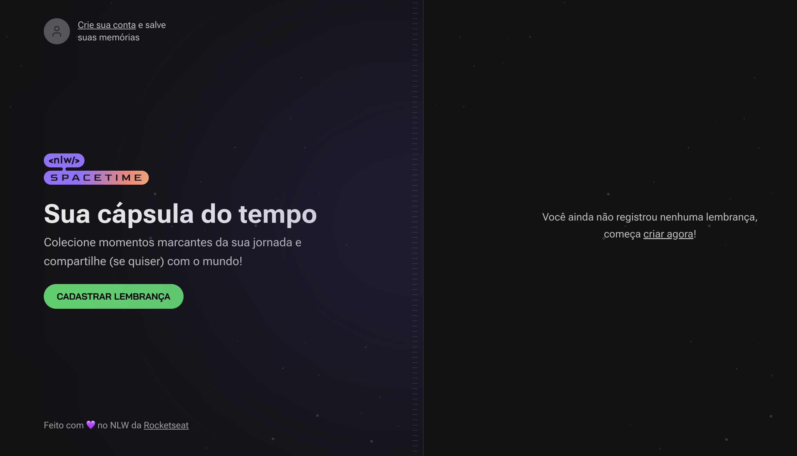

## 🖥️ Projeto
Esse é um projeto para desenvolver uma cápsula do tempo, com ambiente Web, Server e Mobile, construída com React, Next.js, TailwindCSS e TypeSCript.

## 🚀 Tecnologias
Esse projeto foi desenvolvido durante o NLW da Rocketseat com as seguintes tecnologias:

- React
- Next.js
- TailwindCSS
- TypeSCript
- Git e Github

## Observação
O NLW tinha duas trilhas, a explorer e a ignite. Consegui concluir a explorer totalmente, mas a ignite, que é desse projeto, não consegui ver todas as aulas, mas futuramente vou tentar concluir esse projeto também.

Foi muito aprendizado, não conhecia essas tecnologias utilizadas, mas fiquei muito empolgado em estudar mais sobre elas, pois facilitam bastante e otimizam o desenvolvimento dos sistemas.

